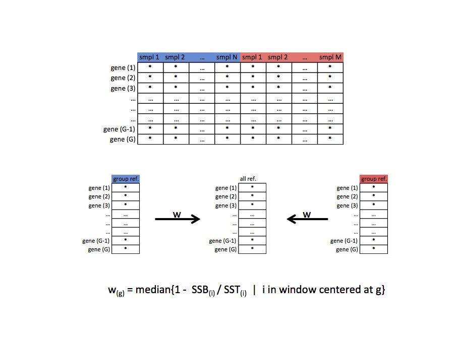

```{r, echo=FALSE, results="hide", message=FALSE}
require(knitr)
opts_chunk$set(error=FALSE, message=FALSE, warning=FALSE)
```

```{r style, echo=FALSE, results='asis'}
BiocStyle::markdown()
```


## Introduction

Global normalization methods such as quantile normalization
@Bolstad2003, @Irizarry2003 have become a standard part of the
analysis pipeline for high-throughput data to remove unwanted
technical variation. These methods and others that rely solely
on observed data without external information (e.g. spike-ins)
are based on the assumption that only a minority of genes are
expected to be differentially expressed (or that an equivalent
number of genes increase and decrease across biological conditions
@aanes2014normalization). This assumption can be interepreted
in different ways leading to different global normalization
procedures. For example, in one normalization procedure, the method assumes
the mean expression level across genes should be the same across samples
@Robinson2010. In contrast, quantile normalization assumes the
only difference between the statistical distribution of each sample
is technical variation. Normalization is achieved by forcing the
observed distributions to be the same and the average distribution,
obtained by taking the average of each quantile across samples,
is used as the reference @Bolstad2003.

While these assumptions may be reasonable in certain experiments,
they may not always be appropriate @Loven2012, @Hicks2015.
For example, mRNA content has been shown to fluctuate significantly
during zebrafish early developmental stages @aanes2014normalization.
Similarily, cells expressing high levels of c-Myc undergo
transcriptional amplification causing a 2 to 3 fold change in global
gene expression compared to cells expressiong low c-Myc
@Loven2012.

Recently, an R/Biocoductor package (`quantro`) @Hicks2015
has been developed to test for global differences between groups of
distributions to evaluate whether global normalization methods such
as quantile normalization should be applied. If global differences
are found between groups of distributions, these changes may be of technical
or biological of interest. If these changes are of technical interest
(e.g. batch effects), then global normalization methods should be applied.
If these changes are related to a biological covariate (e.g. normal/tumor or
two tissues), then global normalization methods should not be applied
because the methods will remove the interesting biological variation
(i.e. differentially expressed genes) and artifically induce differences
between genes that were not differentially expressed. In the cases
with global differences between groups of distributions
between biological conditions, quantile normalization is
not an appropriate normalization method. In
these cases, we can consider a more relaxed assumption about the data,
namely that the statistical distribution of each sample should be the
same within biological conditions or groups (compared to the more
stringent assumption of quantile normalization, which states the
statistical distribution is the same across all samples).

In this vignette we introduce a generalization of quantile
normalization, referred to as **smooth quantile normalization**
(**qsmooth**), which is a weighted average of the two
types of assumptions about the data. The `qsmooth` R-package
contains the `qsmooth()` function, which computes a weight at
every quantile that compares the variability between groups relative
to within groups. In one extreme, quantile normalization is applied
and in the other extreme quantile normalization within each
biological condition is applied. The weight shrinks the group-level
quantile normalized data towards the overall reference quantiles
if variability between groups is sufficiently smaller than the
variability within groups. The algorithm is described in
Figure 1 below.

Let `gene(g)` denote the ${g}^{th}$ row after sorting
each column in the data. For each row, `gene(g)`, we
compute the weight $w_{(g)} \in [0, 1]$, where a weight of 0 implies
quantile normalization within groups is applied and
a weight of 1 indicates quantile normalization is applied.
The weight at each row depends on the between group sum of squares
$\hbox{SSB}_{(g)}$ and total sum of squares $\hbox{SST}_{(g)}$,
as follows:

$$
w_{(g)} = \hbox{median} \{1 - \hbox{SSB}_{(i)} / \hbox{SST}_{(i)} 
            | ~i = g-k, \dots, g, \dots, g+k \} $$
where $k=$ floor(Total number of genes * 0.05). The number
0.05 is a flexible parameter that can be altered to change the
window of the number of genes considered. In this way, we
can use a rolling median to borrow information from
neighboring genes in the weight.

```{r, fig.cap="Figure 1", out.width = '100%'}

```


# Getting Started

Load the package in R

```{r load-lib, message=FALSE}
library(qsmooth)
```

# Data

The **bodymapRat** package contains an
`SummarizedExperiment` of 652 RNA-Seq samples 
from a comprehensive rat transcriptomic BodyMap study. 
This data was derived from the raw FASTQ files obtained
from Yu et al. (2014) \cite{Yu2014}. It contains expression 
levels from 11 organs in male and female rats at 4
developmental stages. We will use a subset of this data in
this vignette.

## bodymapRat example - Comparing two tissues

This example is based a dataset which contains
brain and liver tissue samples from 21 week old male 
and female rats. eight samples are from males and 
eight samples are from females.

```{r data-1, message=FALSE, warning=FALSE}
library(SummarizedExperiment)
library(bodymapRat)
bm_dat <- bodymapRat()

# select brain and liver samples, stage 21 weeks, and only bio reps
keepColumns = (colData(bm_dat)$organ %in% c("Brain", "Liver")) &
         (colData(bm_dat)$stage == 21) & (colData(bm_dat)$techRep == 1)
keepRows = rowMeans(assay(bm_dat)) > 10 # Filter out low counts
bm_dat_e1 <- bm_dat[keepRows,keepColumns]
bm_dat_e1
```

# Using the `qsmooth()` function

## Input for `qsmooth()`

The `qsmooth()` function must have two objects as input:

1. `object`: a data frame or matrix with observations
(e.g. probes or genes) on the rows and samples as the 
columns. `qsmooth()` accepts objects which are a data 
frame or matrix with observations (e.g. probes or genes) 
on the rows and samples as the columns.
2. `group_factor`: a continuous or categorial covariate
that represents the group level biological variation 
about each sample. For example if the samples 
represent two different tissues, provide `qsmooth()` 
with a covariate representing which columns in the 
`object` are different tissue samples.
2. `batch`: **optional** batch covariate (multiple
batches are not allowed). If batch covariate is provided,
`ComBat()` from `sva` is used prior to
qsmooth normalization to remove batch effects.
See `ComBat()` for more details.
3. `norm_factors`: **optional** scaling normalization factors.
Default is `NULL`. If `norm_factors` is not equal to
`NULL`, the user can provide a vector of scaling factors
that will be used to modify the expression data set prior to
applying the `qsmooth` algorithm.
4. `window`: window size for running median (defined as a
fraction of the number of rows of the data object.
Default is 0.05. 


## Running `qsmooth()`

### bodymapRat example - Comparing two tissues

Here, the groups we are interested in comparing 
are the two types of tissues in the 21 week old
male and female rats. The groups we are interested 
in comparing is contained in the `organ` 
column in the `colData(bm_dat_e1)` dataset. To run the 
`qsmooth()` function, input the data object and the
object containing the phenotypic data. 

The first row shows the boxplots and density plot
of the raw data that has been transformed on the 
`log2()` scale and added a pseudo-count of 1 (i.e. 
`log2(counts+1)`). 

The second row shows the boxplots and density plot 
of the qsmooth normalized data.

```{r calculate-qsmooth1, fig.height=10, fig.width=10}
library(quantro)

par(mfrow=c(2,2))
pd1 <- colData(bm_dat_e1)
counts1 <- assay(bm_dat_e1)[!grepl("^ERCC", 
                      rownames( assay(bm_dat_e1))), ]
pd1$group <- paste(pd1$organ, pd1$sex, sep="_")

matboxplot(log2(counts1+1), groupFactor = factor(pd1$organ),
           main = "Raw data", xaxt="n", 
           ylab = "Expression (log2 scale)")
axis(1, at=seq_len(length(as.character(pd1$organ))),
     labels=FALSE)
text(seq_len(length(pd1$organ)), par("usr")[3] -2, 
     labels = pd1$organ, srt = 90, pos = 1, xpd = TRUE)

matdensity(log2(counts1+1), groupFactor = pd1$organ, 
           main = "Raw data", ylab= "density",
           xlab = "Expression (log2 scale)")
legend('topright', levels(factor(pd1$organ)), 
       col = 1:2, lty = 1)

qs_norm_e1 <- qsmooth(object = counts1, group_factor = pd1$organ)
qs_norm_e1 

matboxplot(log2(qsmoothData(qs_norm_e1)+1), 
           groupFactor = pd1$organ, xaxt="n",
           main = "qsmooth normalized data", 
           ylab = "Expression (log2 scale)")
axis(1, at=seq_len(length(pd1$organ)), labels=FALSE)
text(seq_len(length(pd1$organ)), par("usr")[3] -2, 
     labels = pd1$organ, srt = 90, pos = 1, xpd = TRUE)

matdensity(log2(qsmoothData(qs_norm_e1)+1), groupFactor = pd1$organ,
           main = "qsmooth normalized data",
           xlab = "Expression (log2 scale)", ylab = "density")
legend('topright', levels(factor(pd1$organ)), col = 1:2, lty = 1)
```

The smoothed quantile normalized data can be 
extracted using the` qsmoothData()` function
(see above) and the smoothed quantile weights
can plotted using the `qsmoothPlotWeights()` 
function (see below).

```{r plot-qsmooth1-weights}
qsmoothPlotWeights(qs_norm_e1)
```

The weights are calculated for each quantile 
in the data set. A weight of 1 indicates 
quantile normalization is applied, where as a 
weight of 0 indicates quantile normalization
within the groups is applied. See the Figure 1 
for more details on the weights.


In this example, the weights range from 0.2 
to 0.8 across the quantiles, where the weights 
are close to 0.2 for the quantiles close to 0 
and the weights are close to 0.8 for the quantiles 
close to 1. This plot suggests the distributions
contain more variablity between the groups compared 
to within groups for the small quantiles (and the 
conventional quantile normalization is not 
necessarily appropriate). As the quantiles get 
bigger, there is less variability between groups 
which increases the weight closer to 0.8 as the 
quantiles get bigger.

However, if the weights are close to 1 
across all the quantiles, this indicates that there 
is no major difference between the group-level
quantiles in the two groups 

# References

# Session Info

```{r session-info}
sessionInfo()
```
